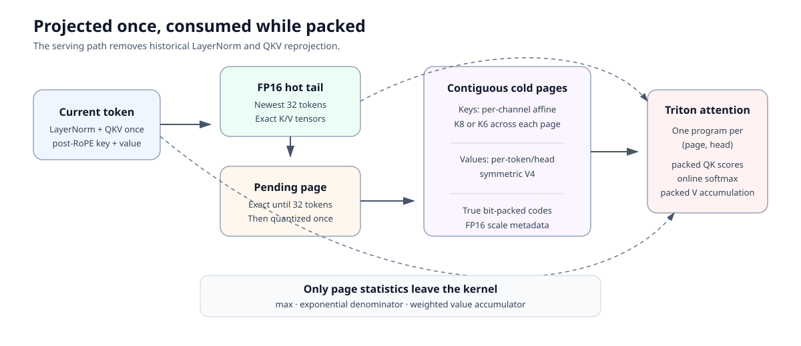
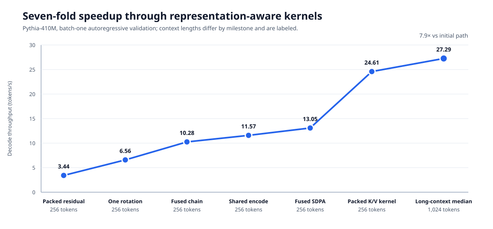
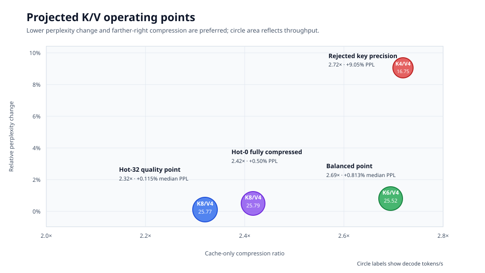

# Compress the Cache, Not the Computation

## Direct packed K/V attention with near-baseline perplexity on Pythia-1.4B

Long-context autoregressive generation has an awkward systems problem: the key/value cache grows with every token, but conventional attention kernels expect that cache in a dense floating-point layout. Compressing the cache can save memory, yet repeatedly reconstructing it often gives the savings back as latency.

We built a different path. Old K/V pages remain packed at 4–8 bits, a small recent tail stays in FP16, and a custom Triton kernel consumes both representations directly during attention. There is no full-cache materialization on the generation path.

Our best quality-oriented configuration—8-bit keys, 4-bit values, and a 32-token FP16 hot tail—reduced measured K/V storage by **2.32×** with a median perplexity change of **+0.115%** across five held-out text windows. A more aggressive 6-bit-key configuration reached **2.69×** compression at **+0.813%** median perplexity change.

## The route here was not a straight line

The project began with GIHKCC-style residual compression: anchors plus quantized deltas, including adjacent-layer and bidirectional “meet in the middle” variants. Those experiments taught us something useful. Residual structure can reconstruct tensors accurately, but long dependency chains concentrate error in deeper layers and sequential decoding work is difficult to parallelize.

Moving compression to the projected keys and values changed the problem. The cache is the persistent state that grows with context, and attention only needs it in a narrow sequence of operations. That makes it possible to store a compact representation and fuse dequantization into the consumer rather than reconstructing a large intermediate tensor.

We also explored ideas that did not survive measurement: direct packed residual attention, fused chained-delta decoding, shared encoding, and a fused SDPA path. Each removed some overhead, but none eliminated the serial dependency at the heart of residual reconstruction. The performance breakthrough came from independent packed K/V pages with direct page/head-aware attention.

## What is actually stored

The cache is divided into two regions:

- A **cold region** of contiguous quantized pages, with per-page/per-head scale and offset metadata.
- A **hot tail** of recent FP16 tokens, plus a short pending buffer before a page is sealed.

During decoding, the Triton kernel reads packed cold pages and FP16 hot tokens in the same attention pass. Quantized values are reconstructed in registers close to use. The implementation supports non-byte-aligned widths such as 6-bit keys rather than rounding every option to 8 bits.

Reported compression includes packed payloads, quantization metadata, the FP16 tail, and pending state. It is not a payload-only theoretical ratio.

## The quality–memory frontier

The five-window validation used fixed held-out WikiText-2 windows on EleutherAI Pythia-1.4B, with FP16 as the paired baseline for each window. We measured perplexity change, KL divergence, top-1 agreement, storage ratio, and generation throughput.

| Configuration | K/V compression | Median PPL change | Median KL | Top-1 agreement | Median throughput |
|---|---:|---:|---:|---:|---:|
| K8/V4, hot 32 | 2.32× | +0.115% | 0.00207 | 97.66% | 25.77 tok/s |
| K6/V4, hot 32 | 2.69× | +0.813% | 0.00642 | 95.70% | 25.52 tok/s |
| K8/V4, hot 0 | 2.42× | +0.50%* | — | — | 25.79 tok/s* |
| K4/V4 | 2.72× | +9.05%* | — | — | 16.75 tok/s* |

\*The hot-0 and K4/V4 points are from the earlier long-context comparison rather than the five-window sweep, so they are directional rather than directly pooled estimates.

The sharp contrast between K6/V4 and K4/V4 is important. Keys are particularly sensitive because their error perturbs attention scores before the softmax. Four-bit values can remain usable when keys retain more precision; pushing both to four bits crosses a much less favorable quality boundary.

The 32-token hot tail is also more than an implementation convenience. Keeping the newest tokens exact protects the positions most likely to receive high attention mass and avoids quantizing pages that have not yet accumulated enough tokens to amortize their metadata.

## Speed came from changing the dataflow

The first packed residual implementation generated only **3.44 tokens/s**. A sequence of increasingly fused residual kernels raised that to roughly **13 tokens/s**, but the dependency chain remained.

The direct packed K/V kernel reached **24.61 tokens/s** in the initial comparison and **27.29 tokens/s** as the median of the repeated long-context K8/V4 run. In other words, the useful optimization was not a cleverer unpack loop. It was choosing a representation that lets the GPU process pages and heads independently.

This is the central systems result: compression becomes practical when the compressed representation is designed around its consumer.

## What we can and cannot claim

The evidence supports a concrete claim: on our tested Pythia-1.4B, batch-one, desktop-GPU setup, direct packed attention offers a useful quality–memory frontier and avoids the dominant cost of full-cache reconstruction.

It does **not** yet establish universal behavior across model families, architectures, prompt lengths, batch sizes, or hardware. The current implementation is a research prototype, not a drop-in production cache. Compression ratios are lower at short contexts because metadata and the hot tail occupy a larger fraction of storage. Small negative perplexity deltas on individual windows are measurement variation, not evidence that lossy compression improves the model.

The next validation step is broader rather than more exotic: multiple model families and sizes, longer context sweeps, standard downstream tasks, and comparisons against established KV-cache quantizers under matched accounting and hardware conditions. Those experiments will tell us whether the observed frontier is a Pythia-specific result or a more general property of direct packed attention.

For full methodology, repeat-level results, limitations, and reproducibility commands, see the [technical report](TECHNICAL_REPORT.md).
